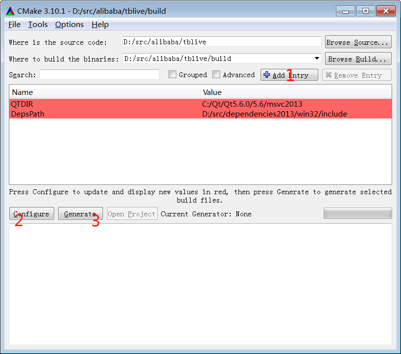
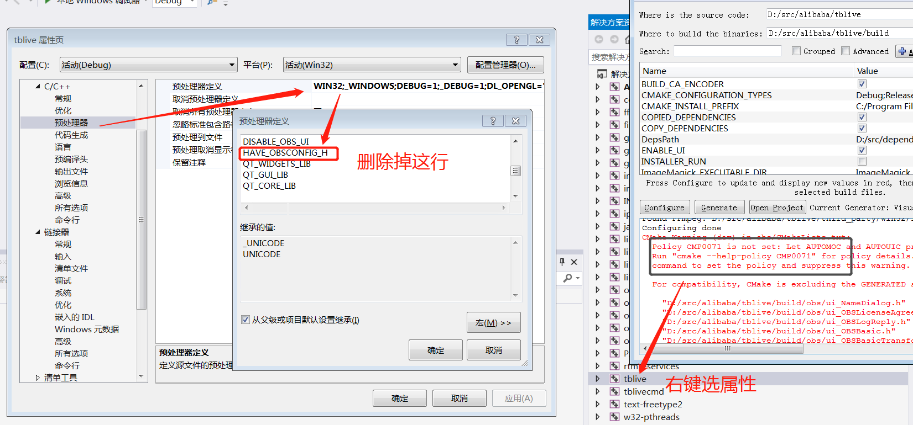
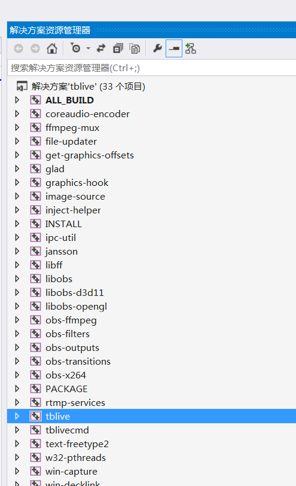
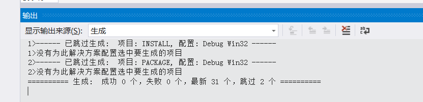
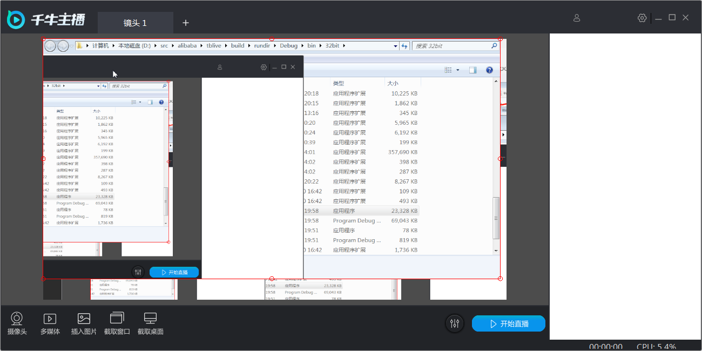
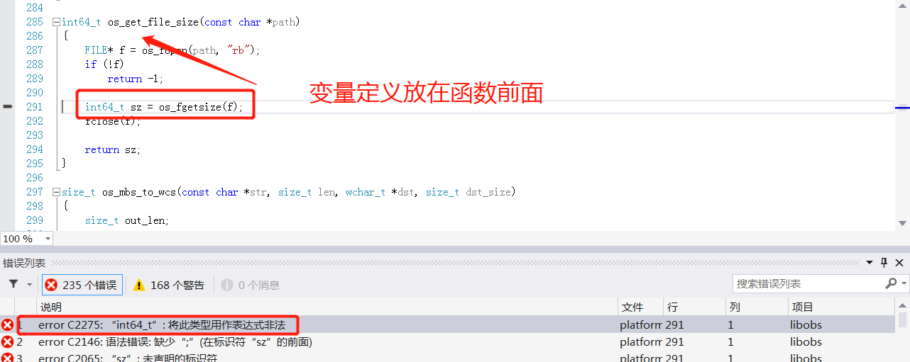
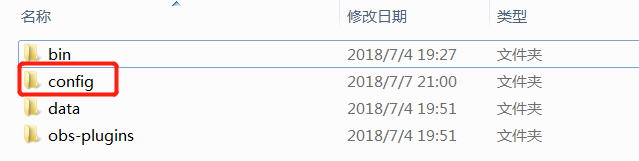

千牛主播（tblive）
====

tblive开源项目对应的产品是**千牛主播**，是一个独立的PC端主播工具，基于开源软件[OBS Studio](https://github.com/jp9000/obs-studio)来修改定制.

项目说明
====
tblive是一款优秀的基于obs-studio的直播软件，基于此本项目将添加单独录制的功能，可以一键开始，结束，配置录制文件格式，保存路径

## Windows下开发环境搭建

### 安装VS2013 + Update4

### 安装 Qt5.6_vs2013
http://download.qt.io/official_releases/qt/5.6/5.6.0/qt-opensource-windows-x86-msvc2013-5.6.0.exe

并设置环境变量 QTDIR: `C:\Qt\Qt5.6.0\5.6\msvc2013`

### 安装qt-vs-addin
http://mirrors.ustc.edu.cn/qtproject/archive/vsaddin/qt-vs-addin-1.2.5.exe

VS2013中，QT5 - [Qt-option]，设置qt版本

### 安装cmake
https://cmake.org/files/v3.5/cmake-3.5.0-rc3-win32-x86.msi

并将cmake的bin路径添加到PATH

### 使用cmake-gui生成工程编译

设置code source：比如 `D:/src/alibaba/tblive`

设置build目录：`D:/src/alibaba/build`


点击'Configure'，然后选中COPY_DEPENDENCIES选项，再点击'Configure'，最后点击'Generate'


## 常见错误
Policy CMP0071
>Policy CMP0071 is not set: Let AUTOMOC and AUTOUIC process GENERATED files.
  Run "cmake --help-policy CMP0071" for policy details.  Use the cmake_policy
>  command to set the policy and suppress this warning.
删除HAVE_OBSCONFIG_H


用vs2013打开build目录下的obs-studio.sln，然后生成；生成的可执行程序在rundir目录下。


## 运行效果
 

## 常见编译错误
error C2275
>错误	1	error C2275: “int64_t”: 将此类型用作表达式非法	D:\src\alibaba\tblive\libobs\util\platform.c	291	1	libobs


# 修改代作为录屏软件
## 禁用登录操作
## 将直播改为录制操作
## 修改配置文件在安装目录下
> 修改 obs-app.cpp 文件
```C
  static bool portable_mode = true;//false ->true
```



